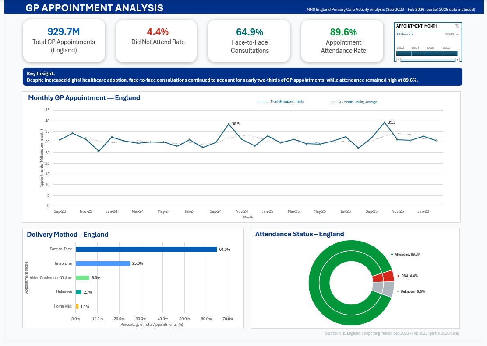
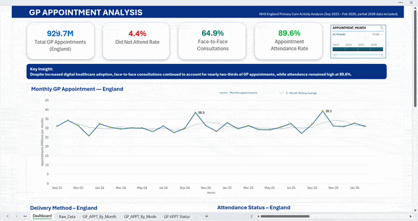
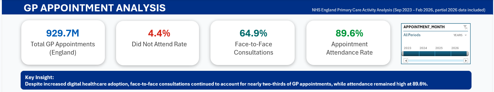
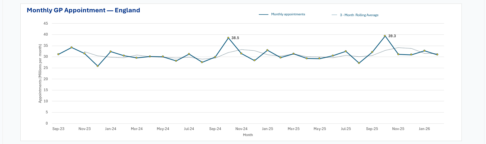
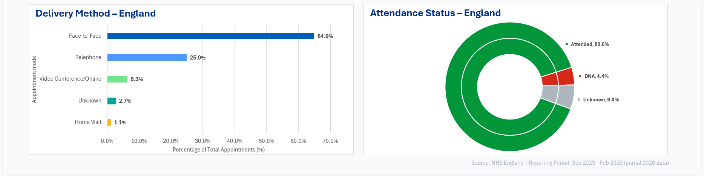

# NHS GP Appointments Analysis — England September 2023 to February 2026




---

## 🏥 Project Overview

This project analyses NHS England GP appointment data covering September 2023 to February 2026. The dataset contains pre-aggregated appointment counts, each row represents a unique combination of month, delivery mode and attendance status rather than an individual patient record, with a total of over 929 million appointments recorded across the full period.

The objective was to transform large-scale operational data into actionable insights through an interactive Excel dashboard, answering real operational questions relevant to NHS primary care planning.

---

## 🎯 Business Problem

GP appointment demand and missed appointments represent a significant operational challenge for the NHS. This project aimed to answer three key business questions:

- How has GP appointment demand changed over time across England?
- How are appointments delivered across different consultation methods, and what does this tell us about patient and clinician preferences?
- What is the operational impact of missed appointments, and where does capacity improvement opportunity exist?

---

##  Analytical Approach

**Data Preparation**
Downloaded raw appointment data from the NHS England Open Data Portal. Explored the dataset structure and identified key fields including appointment month, delivery mode, attendance status and appointment counts. Confirmed data coverage and noted that 2026 data is partial, covering January and February only.

**Data Validation**
Verified row level aggregation structure to ensure accurate summation of appointment counts. Identified and noted the presence of an Unknown category across delivery mode and attendance status fields, which is not fully defined in NHS source documentation.

**Data Modelling**
Built multi-dimensional PivotTable models to aggregate appointment records by month, consultation method and attendance status, enabling flexible cross-dimensional analysis.

**KPI Definition**
- **DNA Rate (Did Not Attend)** — Total DNA appointments divided by total appointments across the reporting period
- **Attendance Rate** — Total attended appointments divided by total appointments
- **Face-to-Face Rate** — Total face-to-face appointments divided by total appointments
- **Monthly Average** — Total appointments divided by number of months in the reporting period

**Trend Analysis**
Applied a 3-month rolling average trendline to monthly appointment volumes to smooth short term fluctuations and reveal underlying demand patterns. Rolling average calculated as the mean of the current month and the two preceding months.

**Dashboard Development**
Designed an interactive KPI dashboard with a year slicer allowing dynamic filtering by period. Annotated peak demand months directly on the trend chart and applied colour coded KPI cards to draw immediate attention to key metrics.

**Insight Generation**
Extracted operational insights from the data to answer the original business questions, quantifying the capacity impact of missed appointments and identifying recurring seasonal demand patterns with direct relevance to NHS operational planning.

---

## 🎥 Interactive Dashboard Demo



> The dashboard includes an interactive year slicer allowing dynamic filtering across 2023, 2024, 2025 and 2026.

---

## 📊 Dashboard Preview

### Full Dashboard


### KPI Cards


### Monthly Appointment Trends


### Delivery Method and Attendance Status


---

## 📋 Analyst Summary

| Metric | Value |
|--------|-------|
| Total Appointment Records | 929.7M |
| Monthly Average | ~31M appointments |
| DNA Rate | 4.4% (~40M missed appointments) |
| Face-to-Face Rate | 64.9% |
| Attendance Rate | 89.6% |
| Peak Demand Month | October (all years) |

---

## 🔑 Key Insights

- **Face-to-face consultations accounted for 64.9% of all appointments**, indicating that despite increased digital adoption following the pandemic, in-person consultations remain the dominant model of care in primary practice. This has implications for estate planning and workforce deployment in primary care settings

- **Telephone appointments represented 25.0% of activity**, making it the second most common delivery method and reflecting a meaningful shift toward remote consultations, though growth appears to have plateaued across the reporting period

- **Approximately 40 million appointments were missed during the reporting period**, with a DNA rate of 4.4%. Even a modest 1% reduction in missed appointments would release an estimated 9 million appointment slots across England, representing a significant capacity improvement opportunity for NHS commissioners

- **Overall attendance remained strong at 89.6%**, reflecting consistent patient engagement across the full reporting period

- **October consistently recorded the highest appointment volumes** across all three years analysed, likely driven by seasonal illness and the onset of winter pressures. This pattern repeats consistently across 2023, 2024 and 2025, suggesting it is a structural feature of primary care demand that commissioners should plan for proactively

---

## ⚠️ Limitations

- Data is aggregated at national level only, with no regional breakdown by Integrated Care Board or NHS Trust available in this dataset
- 2026 data is partial, covering January and February only, which may affect full year trend interpretation
- The Unknown appointment category is not fully defined in NHS source documentation and has been retained but not included in primary analysis
- The dataset does not include patient level demographics, limiting analysis of attendance patterns by age or deprivation
- Rolling average trendline is visual only and has not been subject to formal statistical testing

---

## 📈 Future Improvements

With access to additional data and tools, this analysis could be extended to include:

- Regional breakdown by Integrated Care Board to identify geographical variation in appointment demand and DNA rates
- Comparison with GP workforce data to assess capacity relative to demand pressure
- Demographic analysis including age and deprivation indices if patient level data becomes available
- Longitudinal comparison pre and post 2019 to assess the lasting impact of the pandemic on primary care delivery
- Forecasting future appointment demand using time-series modelling
- Statistical testing to confirm whether October peaks are statistically significant
- SQL pipeline for automated data refresh and reproducible analysis
- Power BI deployment for web-based interactive access without requiring Excel

---

##  Skills Demonstrated

- Cleaning and validating large NHS operational datasets
- Building multi-dimensional PivotTable models to aggregate millions of records
- Defining and calculating operational KPIs for healthcare settings
- Designing KPI dashboards for stakeholder reporting
- Time-series trend analysis using rolling averages
- Communicating operational insights and their implications through data visualisation
- Translating raw data into actionable business recommendations
- Working independently with real publicly available NHS data

---

## 📂 Project Structure
```
nhs-gp-appointments-dashboard/
│
├── screenshots/
│   ├── dashboard-overview.png
│   ├── kpis.png
│   ├── appointment-trends.png
│   ├── delivery-attendance.png
│   └── dashboard-demo.gif
│
├── NHS_GP_Appointments_Dashboard.xlsx
└── README.md
```
> **Note:** The Excel file cannot be previewed directly on GitHub due to file size. To explore the full interactive dashboard including slicers and pivot tables, download the file and open locally in Microsoft Excel.
>
> [Download Excel Dashboard](https://github.com/Fariha-K/nhs-gp-appointments-dashboard/raw/refs/heads/main/NHS_GP_Appointments_Dashboard.xlsx)

---

##  Data Source

NHS England GP Appointments Data — publicly available at:
https://digital.nhs.uk/data-and-information/publications/statistical/appointments-in-general-practice

*Reporting period: September 2023 to February 2026 (2026 data partial)*

---

##  Conclusion

This project demonstrates the complete analytical process of cleaning, validating, modelling and visualising large-scale NHS operational data. The dashboard translates over 929 million aggregated appointment records into insights that support understanding of demand patterns, consultation delivery and appointment attendance, while highlighting opportunities for future analytical development using SQL and Power BI.
The analysis reveals that face-to-face care remains dominant despite digital expansion, that missed appointments represent a quantifiable and addressable capacity challenge, and that seasonal demand peaks are a consistent and predictable feature of primary care in England. All findings have direct relevance to NHS operational planning and resource allocation.

